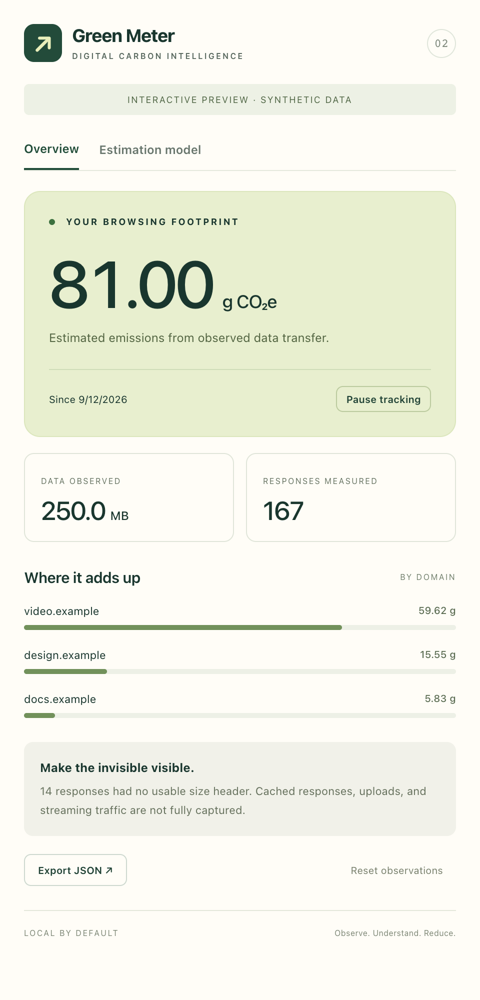
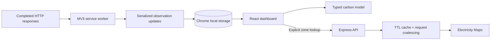

<div align="center">

# Green Meter

### Make the internet’s invisible footprint visible.

**🏆 HackKurius Winner — Best of Air Challenge**

[](tests)


[](LICENSE)

[Get started](#get-started) · [Architecture](docs/architecture.md) · [Methodology](docs/methodology.md) · [Privacy](docs/privacy.md)

</div>

Green Meter is a browser extension that turns observed network traffic into a clear, explorable carbon estimate. See which domains account for your data transfer, adjust the energy assumptions behind the numbers, and connect regional grid-intensity data without sending your browsing history to a server.

<p align="center"></p>

## What it does

- **Traffic → carbon context.** A Manifest V3 service worker aggregates measurable HTTP response sizes and attributes them to initiating domains.
- **An explainable model.** Every estimate comes from visible, configurable energy and carbon-intensity factors. Missing measurements are counted explicitly.
- **A focused React dashboard.** Explore domain contributions, pause collection, reset a session, or export observations as JSON.
- **Optional grid intelligence.** A TypeScript / Express API connects to Electricity Maps with server-side credentials, validated responses, a bounded TTL cache, request coalescing, timeouts, and rate limiting.
- **Local control.** Domain aggregates stay in Chrome’s local extension storage. No account, analytics, or background upload pipeline.

## Get started

Requires **Node.js 22.12+** and Chrome 120+ or a compatible Chromium browser.

```bash
git clone https://github.com/asharma391/Green-Meter.git
cd Green-Meter
npm ci
npm run build
```

Open `chrome://extensions`, enable **Developer mode**, choose **Load unpacked**, and select **`dist/`**. Pin Green Meter, browse a few pages, and open the popup. No API key is required for the configurable local estimation mode.

For a standalone interactive popup preview:

```bash
npm run dev
```

The preview uses labeled synthetic data. To test real traffic, load the built extension; the development server does not install it.

### Optional Electricity Maps API

```bash
cp .env.example .env
# Add your own ELECTRICITYMAPS_KEY to .env
npm run build
node --env-file=.env dist-api/index.js
```

In the popup, open **Estimation model → Connect a local grid-data API**, enter a supported zone such as `CA-ON`, and fetch a snapshot. Provider access depends on your token’s zone coverage. The token never enters the extension bundle. Only the zone is sent to the API.

For a containerized API, run `docker compose up --build` with the same `.env`. The container runs as a non-root user and exposes the API only on the host’s loopback interface. See [deployment](docs/deployment.md).

## Architecture



```text
src/
├── background/   # Traffic observation and serialized state updates
├── core/         # Pure estimation, validation, aggregation, and types
└── popup/        # React dashboard and extension/preview adapter
server/          # Optional grid-intensity API
public/          # Extension manifest and original icons
scripts/         # Vite + esbuild packaging
tests/           # Model, worker, and API regression tests
docs/            # Architecture, methodology, privacy, and deployment
```

The core model is independent of Chrome and React. The worker owns state mutations; the popup subscribes to storage changes. The optional API has no browsing-data endpoint or database. [Read the design decisions →](docs/architecture.md)

## Development

| Command           | Purpose                                                                |
| ----------------- | ---------------------------------------------------------------------- |
| `npm run dev`     | Interactive dashboard preview                                          |
| `npm run api:dev` | Optional API with watch mode; pass credentials through the environment |
| `npm run build`   | Type-check and build the extension and API                             |
| `npm test`        | Run regression tests                                                   |
| `npm run check`   | Type-check, test, and production-build                                 |
| `npm run format`  | Format source and documentation                                        |

A ready-to-enable [GitHub Actions workflow](docs/ci.yml) checks formatting, types, tests, and the production build, then uploads the unpacked extension. To enable it, copy the template to `.github/workflows/ci.yml` using a GitHub credential with workflow permission. All checks have also been run locally.

## How to read the numbers

The model is `transferred GB × kWh/GB × g CO₂e/kWh`, using decimal GB. The initial **400 g CO₂e/kWh** is an illustrative assumption; **0.81 kWh/GB** retains the original hackathon’s energy coefficient. Neither is presented as a universal, current measurement. Change both in the model panel.

Only successful, non-cached responses with usable `Content-Length` values contribute to measured bytes. Uploads, some streaming traffic, browser-internal requests, and missing headers are outside the estimate. Grid intensity is a selected scenario, not an inferred measurement of every remote server. Changing the model recalculates the entire session. [Methodology and limits →](docs/methodology.md)

## Project roots

Originally built for **HackKurius**, where Green Meter won the **Best of Air Challenge**. This edition modernizes the original extension with React, TypeScript, an explicit estimation model, and a tested API boundary. Original authorship and commit dates are retained; historical credentials and cached IP data have been removed.

Contributions are welcome; start with [CONTRIBUTING.md](CONTRIBUTING.md). Licensed under [GPL-3.0](LICENSE).
